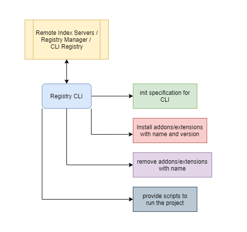

# cobra-cmd-hub

Framework for building command line plugins on top of Golang Cobra Library that allows developers to install and use other (even non golang CLIs) as extensions.

TODO more info

## Cobra commands provided by framework

TODO

rootCLI extensions list

rootCLI extensions installed # list installed ones

rootCLI extensions install <name>@<version>
  
## Getting started

### Adding library to your existing CLI

TODO

### Creating registry of CLIs

TODO - we need example

## Architecture

TODO diagram


======= ALL bellow doesn't make sense to be in the readme IMHO ===

## Registery CLI

We can build a CLI that will be installed in user's system which would perform the below tasks.



## Specification for the CLI registry

```json
{
  "name": "",
  "description": "",
  "version": "",
  "environment": "",
  "registry": "",
  "homepage": "",
  "bin": {},
  "private": false,
  "dependencies": {},
  "maintainers": {},
  "license": ""
}
```

## Registry Manager

This is the place where developers will be able to push their CLI's as extensions. All the information about the extensions like name, versions, docs, homepage, licence, size, repo, etc will be present.

We can use GitHub packages to host packages and use them as extensions/dependencies in other CLI's. It will also help developers to create DevOps end to end workflow.

## Executing Extensions in host CLI using Registry CLI

This can have two modes -

1. Local Mode - Package can be installed that are already present in the $GOPATH
2. Global Mode - Package can be installed from Registry manager.

Package (go CLI module) will be added to `specification.json` & `go.mod` file of project and hence can be used as features in the host CLI.

Feature to remove and update package in Registry CLI
