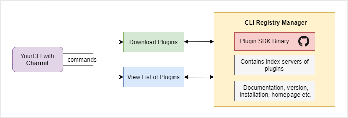

# Charmil

Framework for building command line plugins on top of Golang Cobra Library that allows developers to install and use other (even non golang CLIs) as extensions.
Charmil will let you control your cobra based CLIs and extend them without embedding any plugin code into your CLI.

> NOTE: Project is still under construction

## Documentation

Visit the [Charmil Documentation](docs/src)

## How it works

## Features

- Install any CLI as part of your host CLI (even CLI that you do not control)
- Build and deploy registry with different versions of CLI's to install that can be hosted in Github Pages or as yaml files
- Provide set of the cobra commands that will let users install, update, remove and manage all available extensions

## Getting started

### Adding library to your existing CLI

Include Charmil in your CLI by doing `$ go get -u github.com/aerogear/charmil`
You can import charmil in your CLI, which will provide you all the extensions out of the box. You can install specific plugins with the install command.
After installing the extension, users can use the features of that plugin without writing code for that particular feature which that plugin provides.

### Creating registry of CLIs

> TODO
> For full example of registry look into:
> https://aerogear.github.io/charmil/registry/example/registry.json

### Add/Publish your plugins to Charmil

A remote index server (github repo/pages) for a plugin will contain the metadata, docs, etc. The Developers will be able to push their plugins/index servers, so that they will be publicly available to download as per use in CLI.
