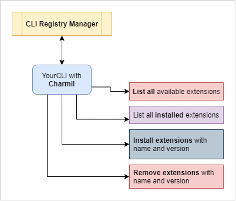

# Charmil

Framework for building command line plugins on top of Golang Cobra Library that allows developers to install and use other (even non golang CLIs) as extensions.
Charmil will let you control your cobra based CLIs and extend them without embeeding any plugin code into your CLI.

> NOTE: Under construction

## Features

- Install any CLI as part of your host CLI (even CLI that you do not control)
- Build and deploy registry with different versions of CLI's to install that can be hosted in Github Pages or as yaml files
- Provide set of the cobra commands that will let users to install and manage all available extensions

## Commands that will be added to your CLI by Charmil

`$ yourCLi extensions list`

`$ yourCLi extensions installed` # list installed ones

`$ yourCLi extensions install <name>@<version>`

`$ yourCLi extensions remove <name>@<version>`

## Getting started

### Adding library to your existing CLI

TODO

### Creating registry of CLIs

TODO

For full example of registry look into:
https://aerogear.github.io/charmil/registry/example/registry.json

## Architecture

