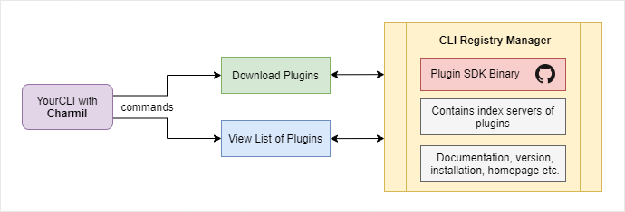
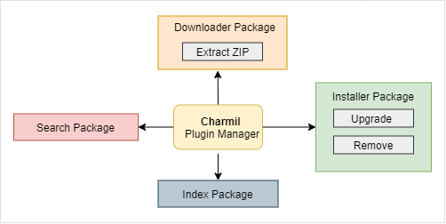

# Charmil

> TODO Logo

Framework for building command line plugins on top of Golang Cobra Library that allows developers to install and use other (even non golang CLIs) as extensions.
Charmil will let you control your cobra based CLIs and extend them without embeeding any plugin code into your CLI.

> NOTE: Under construction

## Working

## Features

- Install any CLI as part of your host CLI (even CLI that you do not control)
- Build and deploy registry with different versions of CLI's to install that can be hosted in Github Pages or as yaml files
- Provide set of the cobra commands that will let users to install, update, remove or manage all available extensions

## Getting started

### Adding library to your existing CLI

Include Charmil in your CLI by doing `$ go get -u github.com/aerogear/charmil`

## Commands that will be added to your CLI by Charmil

1. List all the available extensions
   > `$ yourCLi extensions list`
2. List all the installed extensions
   > `$ yourCLi extensions installed`
3. Search the extensions in local indexes
   > `$ yourCLI extensions --name <name>@<version>`
4. Install the extention in your CLI via name and version
   > `$ yourCLi extensions install <name>@<version>`
5. Remove the extension from your CLI
   > `$ yourCLi extensions remove <name>@<version>`

You can import charmil in your CLI, which will provide you all the extensions out of the box. You can install specific plugins with the install command.

After installing the extension, users can use the features of that plugin without writing code for that particular feature which that plugin provides.

1. Downloader pkg - It will download the binaries of plugins. Binaries may be zip / tar.gz. We need to extract them.
2. Installer pkg - It will download and install a plugin. It will also support upgrade and remove plugins.
3. Index pkg - Get All indexes, add, update or remove a index.
4. Search Package - Search for packages via name, description locally and globally.

### Creating registry of CLIs

> TODO

For full example of registry look into:
https://aerogear.github.io/charmil/registry/example/registry.json

### Add / Publish your plugins to Charmil

A remote index server (github repo / pages) for a plugin will contain the metadata, docs etc. The Developers will be able to push their plugins / index servers, so that they will be publicly available to download as per use in CLI.

## Architecture

