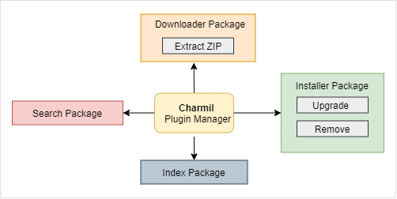

# Architecture

1. Downloader pkg - It will download the binaries of plugins. Binaries may be zip/tar.gz. We need to extract them.
2. Installer pkg - It will download and install a plugin. It will also support upgrade and remove plugins.
3. Index pkg - Get All indexes, add, update or remove an index.
4. Search Package - Search for packages via name, description locally and globally.
   
