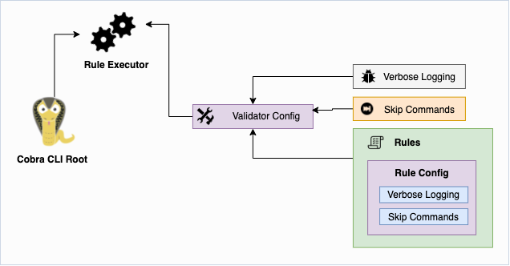

Charmil Validator can be used for testing and controlling many aspects of cobra commands. It provides many rules out of the box for validating the commands.



## Rules provided by validator

#### LengthRule
Length Rule can control the lengths of strings in different attributes of cobra.Command structure.

#### MustExistRule
Must Exist Rule ensures that the selected attributes from `cobra.Command` strcuture must be present in the command.

#### UseMatchesRule
Use Matches Rule compares the Use attribute of `cobra.Command` with the user provided regexp.

#### ExampleMatchesRule
Example Matches Rule ensures that the command is properly documented with the proper examples in it.

#### PunctuationRule
Punctuation Rule checks for the punctuation errors in the command according to industry standards.

## How to use
It is recommended to use the validator while writing unit tests for cobra commands.

1. Create a configuration of type `rules.ValidatorConfig`. You can provide your own ValidatorConfig or use the default one by leaving it empty
```go
import "github.com/aerogear/charmil/validator"

var ruleCfg rules.ValidatorConfig
```
or overriding default config
```go
import "github.com/aerogear/charmil/validator"

ruleCfg := rules.ValidatorConfig{
	ValidatorRules: rules.ValidatorRules{
		Length: rules.Length{Limits: map[string]rules.Limit{"Use": {Min: 1}}},
		MustExist: rules.MustExist{Fields: map[string]bool{"Args": true}},
		UseMatches: rules.UseMatches{Regexp: `^[^-_+]+$`},
	},
}
```
2. Generate the validation errors by using `ExecuteRules` function over the ruleCfg
```go
validationErr := rules.ExecuteRules(cmd, &ruleCfg)
```
`ExecuteRules` function will return a slice of `ValidationError` object, which can be efficiently used for testing purposes.
```go
if len(validationErr) != 0 {
	t.Errorf("validationErr was not empty, got length: %d; want %d", len(validationErr), 0)
}
for _, errs := range validationErr {
	if errs.Err != nil {
		t.Errorf("%s: cmd %s: %s", errs.Rule, errs.Cmd.CommandPath(), errs.Name)
	}
}
```

## Disable a Rule
All the rules provided by charmil are enabled by default. If you want to turn off particular rule or rules, there is an `Disable` option in `RuleOptions` in each rule.

```go
ruleCfg := rules.ValidatorConfig{
	ValidatorRules: rules.ValidatorRules{
		Punctuation: Punctuation{
			RuleOptions: validator.RuleOptions{
				Disable: true,
			},
		},
		UseMatches: UseMatches{
			RuleOptions: validator.RuleOptions{
				Disable: true,
			},
		},

	},
}
```

## Ignore Commands
Sometimes during development, you want to pass the tests for certain commands, but at the same time use Validator for tests. Validation can be skipped/ignored for the commands, mentioned in the validator configuration.
To ignore the commands you need to specify the path of the command in validator configuration.

Assume your CLI is having a command structure like this:
```
mycli
	actions
		create
		update
		delete
		read
```
### Skip single command `mycli actions create`
Use `SkipCommands` option in `ValidatorOptions` to skip validation for a command
```go
ValidatorOptions: rules.ValidatorOptions{
	SkipCommands: map[string]bool{"mycli actions create": true},
},
```

### Skip the command including all children
Use `SkipCommands` option in `ValidatorOptions` using asterisk sign to skip validation for all subcommands
```go
ValidatorOptions: rules.ValidatorOptions{
	SkipCommands: map[string]bool{"mycli actions*": true},
},
```

### Skip the command for specific rule
Use `SkipCommands` option in `RuleOptions` to skip validation for specific rule
```go
Length: rules.Length{
	RuleOptions: validator.RuleOptions{
		SkipCommands: map[string]bool{"mycli actions create": true},
	},
	Limits: map[string]rules.Limit{
		"Use": {Min: 1},
	},
},
```

