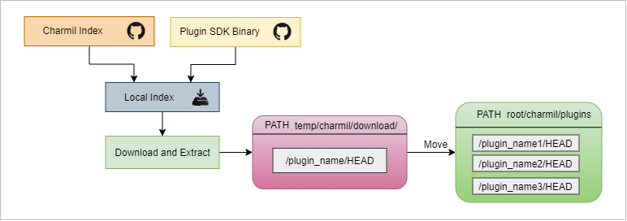
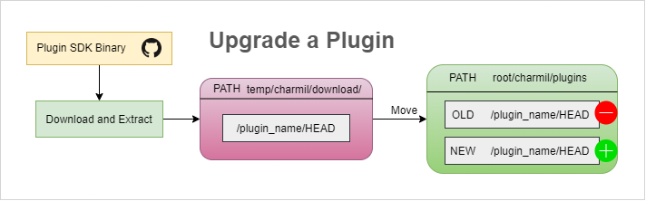

## Extension/Plugin Lifecycle

1. Extensions/Plugins are stored in a plugins folder.
2. A new plugin is firstly downloaded in temp path and later moved into the plugins folder under charmil

## Upgrading a Extension/Plugin

1. Download and Extract the plugin's binary into a temporary path
2. Move the newly downloaded plugin into the plugins directory and delete the older version

## Removing a Plugin

Delete that Plugin's folder to be removed from the plugins directory in charmil.
